## 1. Introduction

A normal deployment replaces your app a little at a time. If the new
version has a bug, some real users hit it before anyone notices —
monitoring catches it eventually, but "eventually" can be minutes of bad
requests.

Blue-green deployment fixes this differently. Instead of replacing the
running app in place, you start the new version next to the old one and
check it privately before anyone else sees it. On its own, ECS's blue/green
feature doesn't actually wait for you to do that checking — the moment
the new version passes its health checks, it shifts all production
traffic over automatically, whether or not anyone looked at it first.
What turns "check it privately" into an actual gate — a real point where
nothing goes live until you say so — is one more piece this guide adds on
top: a manual approval step. With it in place, the deployment stops right
after the new version is reachable for checking, and waits for you to
approve it before a single real user sees it. If it looks wrong, you
reject it instead, and the new version never goes live at all.

In this guide, you'll build that setup on AWS: a container running on ECS
Fargate, deployed through a pipeline that builds your code, ships it to a
new set of tasks, lets you check it privately behind a test rule, pauses
there waiting for your approval, and only then shifts production traffic
over — plus, once it's live, keeps the old version standing by for a few
minutes in case you need to revert instantly.

**A note on how this is built:** this guide uses Amazon ECS's own native
blue/green deployment feature, not AWS CodeDeploy. Up until July 2025, ECS
blue/green deployments needed a separate CodeDeploy application,
deployment group, and an `appspec.yaml` file to coordinate the traffic
shift. As of July 2025, ECS does all of that itself — you just set a
deployment strategy on the service, point it at two target groups, and
ECS handles the shift, the bake time, and rollback on its own. If you're
following an older tutorial and can't find a "CodeDeploy" option in the
ECS console anymore, this is why — it's been folded into ECS directly.

You'll build it two ways:

1. **By hand, in the AWS Console** — so you actually see how each piece
   connects to the next one, not just what a template produces
2. **With CloudFormation** — the same architecture, deployed as one stack

Both end up at the same result. Go through the console version first if
you're newer to this — it's slower, but it's the version that actually
teaches you what's happening.

## 2. Architecture

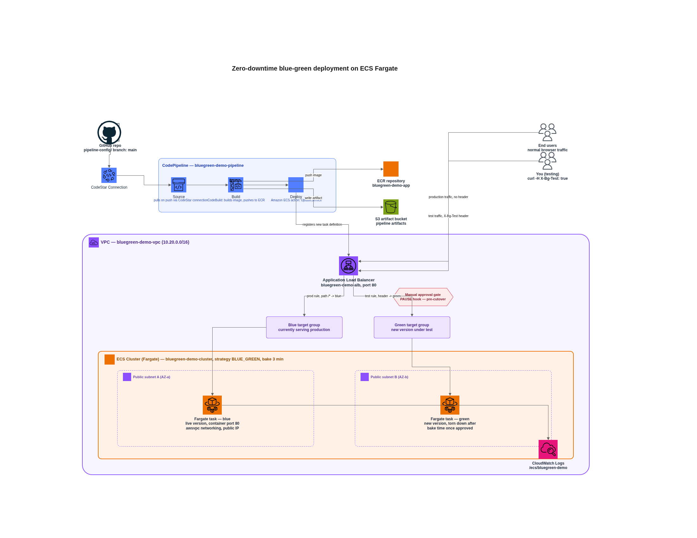

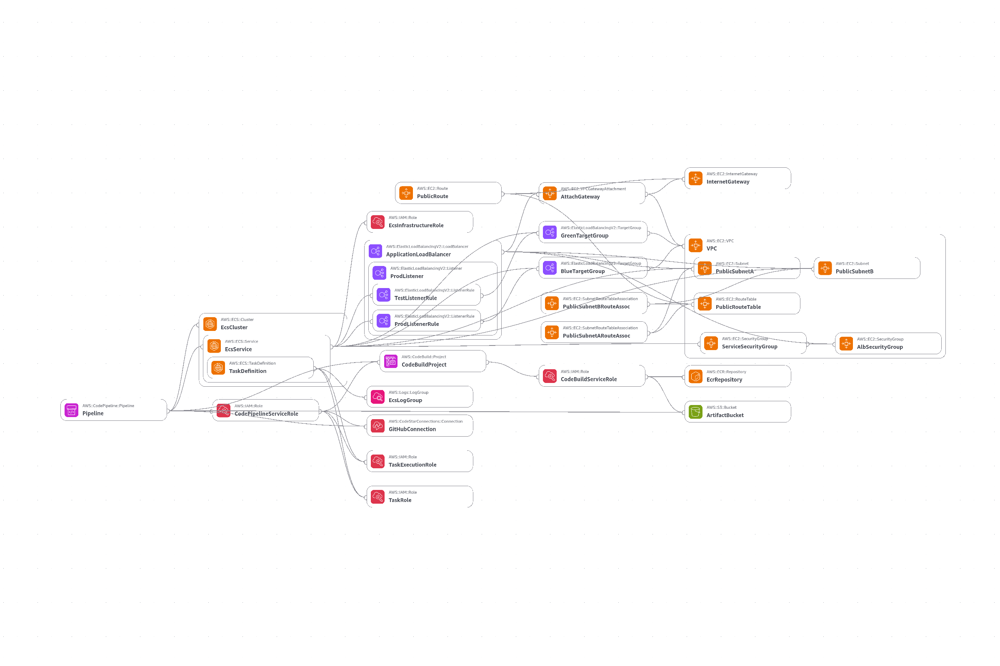

The part that actually makes this zero-downtime is the two target groups
and the two listener rules — both living on the same listener, port 80.
The production rule catches ordinary traffic and always points at
whichever target group is "live." The test rule only fires for requests
carrying a specific header, so you can privately hit the new version
before it goes live without needing a second port. ECS itself flips which
target group each rule points to during a deployment — nothing gets
exposed to real users until it's already been checked.

(If you're used to the older CodeDeploy-based pattern, that one really did
use a separate port for test traffic. Native ECS blue/green doesn't need
that — the ECS "Create service" wizard only ever asks for one listener,
then two rules under it, so a header is what tells the two apart instead
of a port.)

## 3. Before you start

You'll need:

- An AWS account with permissions to create VPCs, ECS, IAM roles, ALBs,
  CodePipeline, and CodeBuild resources. All resources in this guide are
  created in `us-east-1`.
- Docker installed locally, if you want to build and push the first image
  yourself before the pipeline takes over
- A GitHub account and a repo the pipeline can pull from

**Important — clone this repo first:**

```bash
git clone https://github.com/Gbengard/blue-green-ecs-deployment.git
```

The pipeline needs the `pipeline-config/` folder — containing
`buildspec.yml`, `Dockerfile`, and `index.html` — sitting in your own
GitHub repo before it can run. Push the **whole cloned project as-is**,
keeping `pipeline-config/` as a subfolder rather than flattening its
contents into the repo root — Step 9 points CodeBuild at
`pipeline-config/buildspec.yml`, and the buildspec itself `cd`s into
`pipeline-config/` to find the Dockerfile, so the folder needs to stay
where it is. Without this step, the pipeline's Source stage has nothing
to pull, and everything after it will fail before it even starts.

Every resource in this guide has a fixed name, so it's easy to follow and
easy to find again later. Keep this table open as you work through it.

| Resource | Name |
|---|---|
| VPC | `bluegreen-demo-vpc` |
| Internet Gateway | `bluegreen-demo-igw` |
| Public subnet A | `bluegreen-demo-public-a` |
| Public subnet B | `bluegreen-demo-public-b` |
| Route table | `bluegreen-demo-public-rt` |
| ALB security group | `bluegreen-demo-alb-sg` |
| Service security group | `bluegreen-demo-svc-sg` |
| ECR repository | `bluegreen-demo-app` |
| Application Load Balancer | `bluegreen-demo-alb` |
| Blue (primary) target group | `bluegreen-demo-tg-blue` |
| Green (alternate) target group | `bluegreen-demo-tg-green` |
| Production listener rule | port 80, priority 2, path `/*` |
| Test listener rule | same listener (port 80), priority 1, header `X-Bg-Test: true` |
| ECS cluster | `bluegreen-demo-cluster` |
| ECS task definition family | `bluegreen-demo-task` |
| ECS service | `bluegreen-demo-service` |
| Task execution role | `bluegreen-demo-task-exec-role` |
| Task role | `bluegreen-demo-task-role` |
| ECS infrastructure role | `bluegreen-demo-ecs-infra-role` |
| CodeBuild project | `bluegreen-demo-build` |
| CodeBuild service role | `bluegreen-demo-codebuild-role` |
| S3 artifact bucket | `bluegreen-demo-artifacts-<your-account-id>` |
| CodePipeline | `bluegreen-demo-pipeline` |
| CodeStar GitHub connection | `bluegreen-demo-github-connection` |
| CloudWatch log group | `/ecs/bluegreen-demo` |

---

# Manual Approach (AWS Console)

Every step below tells you exactly which console page to open, what to
click, what to type, and which button ends the step. Where it's worth
capturing for your own notes or a write-up, I've marked what to screenshot.

## Step 1 — Create the VPC

1. Open the [**VPC console**](https://us-east-1.console.aws.amazon.com/vpcconsole/home?region=us-east-1#Home:)
2. Click **Create VPC**
3. Choose **VPC only**
4. Name: `bluegreen-demo-vpc`
5. IPv4 CIDR: `10.20.0.0/16`
6. Leave everything else as default
7. Click **Create VPC** at the bottom of the page

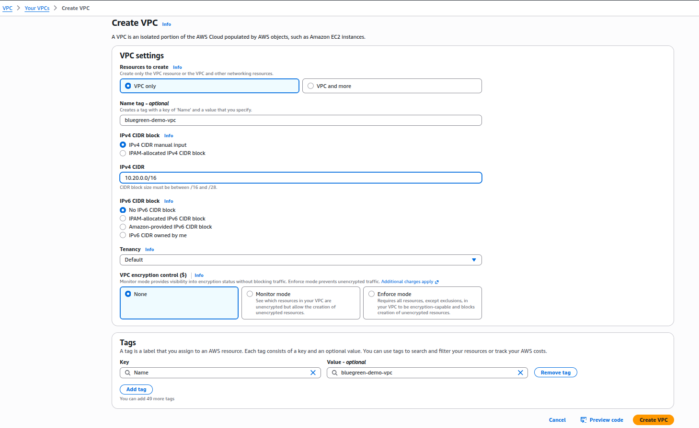

## Step 2 — Create two public subnets

1. In the left sidebar, click **Subnets**
2. Click **Create subnet**
3. VPC ID: choose `bluegreen-demo-vpc`
4. Under **Subnet 1 of 1**: name `bluegreen-demo-public-a`, Availability
   Zone: pick the first one in the list, IPv4 CIDR: `10.20.1.0/24`
5. Click **Add new subnet**
6. Under **Subnet 2 of 2**: name `bluegreen-demo-public-b`, Availability
   Zone: pick a **different** zone from subnet A, IPv4 CIDR: `10.20.2.0/24`
7. Click **Create subnet** at the bottom

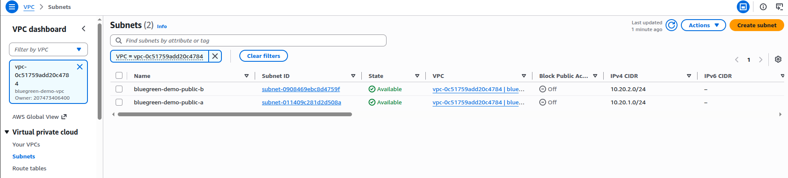

8. Back on the Subnets page, check the box next to one of the new subnets
9. Click **Actions → Edit subnet settings**
10. Turn on **Auto-assign public IPv4 address**, then click **Save**
11. Repeat Steps 8–10 for the second subnet

Two subnets in two different zones matter here — if one zone has a
problem, your app keeps running in the other.

## Step 3 — Internet Gateway and routing

1. Left sidebar → **Internet Gateways** → click **Create internet gateway**
2. Name: `bluegreen-demo-igw` → click **Create internet gateway**
3. On the gateway's page, click **Actions → Attach to VPC**
4. Choose `bluegreen-demo-vpc` → click **Attach internet gateway**

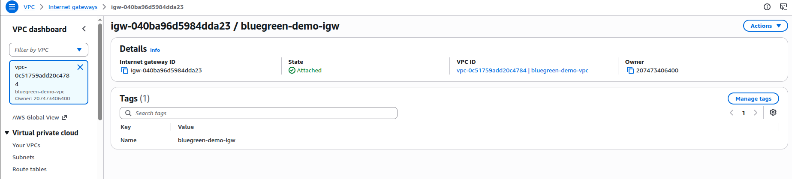

5. Left sidebar → **Route Tables** → click **Create route table**
6. Name: `bluegreen-demo-public-rt`, VPC: `bluegreen-demo-vpc` → click
   **Create route table**
7. Open the new route table → **Routes** tab → click **Edit routes**
8. Click **Add route** → Destination: `0.0.0.0/0`, Target: choose
   **Internet Gateway**, then select `bluegreen-demo-igw` → click **Save changes**

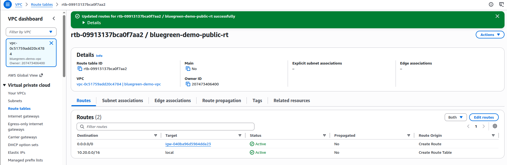

9. Still on the route table, click the **Subnet associations** tab →
   click **Edit subnet associations**
10. Check both `bluegreen-demo-public-a` and `bluegreen-demo-public-b` →
    click **Save associations**

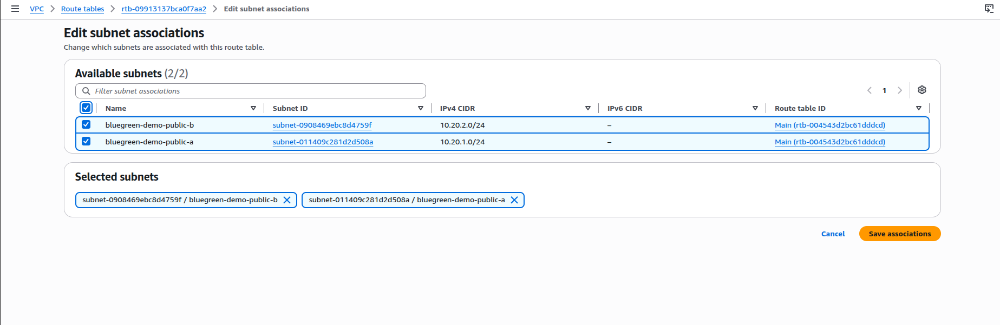

## Step 4 — Security groups

1. **EC2 console** → left sidebar **Security Groups**, or follow this
   [**link**](https://us-east-1.console.aws.amazon.com/ec2/home?region=us-east-1#SecurityGroups:) → click **Create security group**
2. Name: `bluegreen-demo-alb-sg`, Description: anything descriptive, VPC:
   `bluegreen-demo-vpc`
3. Under **Inbound rules**, click **Add rule**:
   - Type: HTTP, Source: Anywhere-IPv4 (`0.0.0.0/0`)

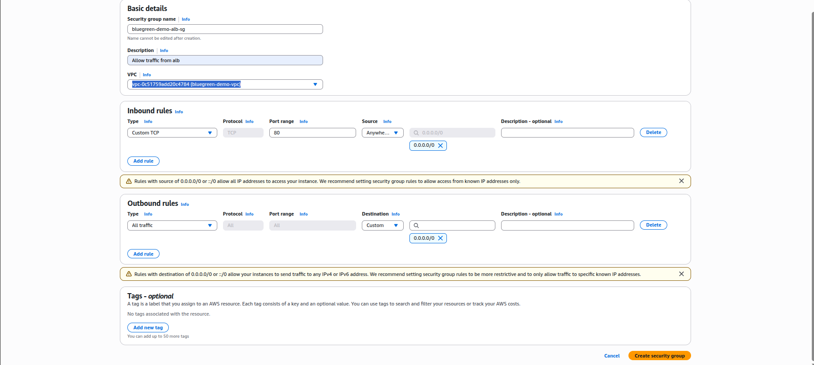

4. Click **Create security group**
5. Click **Create security group** again for the second one
6. Name: `bluegreen-demo-svc-sg`, same VPC
7. Under **Inbound rules**, click **Add rule**: Type: Custom TCP, Port:
   `80`, Source: click the source field, choose **Custom**, then start
   typing `bluegreen-demo-alb-sg` and select it from the dropdown (not an
   IP address)
8. **Check the Outbound rules section before you create it.** The
   console pre-fills a default "All traffic" outbound rule — leave it as
   is, or if it's been narrowed for any reason, add: Type HTTPS, Port
   443, Destination Anywhere-IPv4 (`0.0.0.0/0`). This one is easy to miss
   and causes a very specific, confusing failure later: the task starts,
   then dies with
   `ResourceInitializationError: unable to pull secrets or registry auth ... dial tcp ... i/o timeout`.

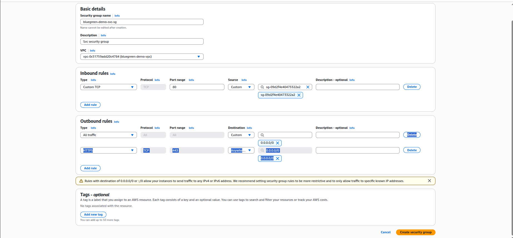

9. Click **Create security group**

This inbound rule from Step 7 is important: it means only traffic coming
through your load balancer can reach the containers, nothing else can
hit them directly.

## Step 5 — Push an image to ECR

1. Click [**ECR console**](https://us-east-1.console.aws.amazon.com/ecr/get-started?region=us-east-1) → click **Create repository**
2. Name: `bluegreen-demo-app`
3. Under **Image scan settings**, turn on **Scan on push**
4. Click **Create repository**
5. Open the repository → click **View push commands** (top right)
6. A dialog shows four commands with your exact account ID and region
   filled in — run them locally, building from the `Dockerfile` and
   `index.html` in `pipeline-config/` in this repo:

```bash
aws ecr get-login-password --region <region> | docker login --username AWS --password-stdin <account-id>.dkr.ecr.<region>.amazonaws.com
docker build -t bluegreen-demo-app pipeline-config/
docker tag bluegreen-demo-app:latest <account-id>.dkr.ecr.<region>.amazonaws.com/bluegreen-demo-app:latest
docker push <account-id>.dkr.ecr.<region>.amazonaws.com/bluegreen-demo-app:latest
```

If you get the error
`aws: [ERROR]: Your session has expired. Please reauthenticate using 'aws login'. password is empty`,
run `aws login` — it opens your browser to log in, then rerun the commands above.

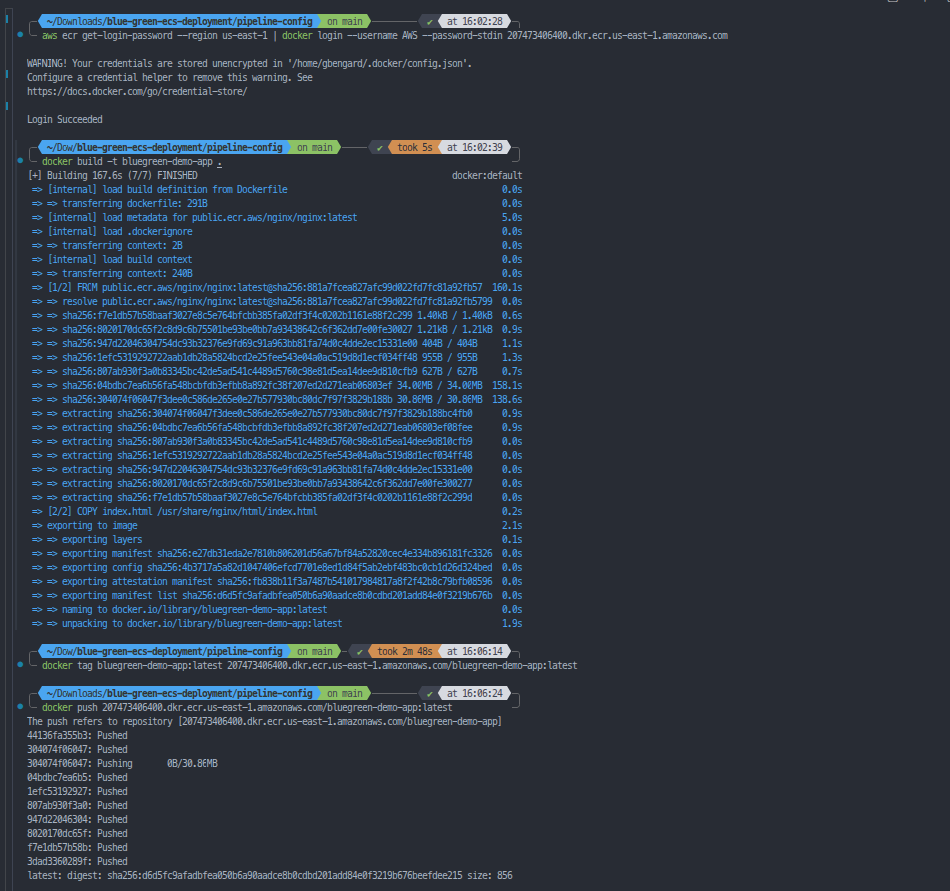

If `docker build` fails with `permission denied while trying to connect
to the Docker API at unix:///var/run/docker.sock`, Docker itself is fine
— your user just isn't in the `docker` group on this machine, so it can't
talk to the Docker daemon without root. Fix it once, permanently, rather
than prefixing every command with `sudo`:

```bash
sudo usermod -aG docker $USER
```

Then fully log out and back in (or reboot) — a new group membership
doesn't apply to already-open terminal sessions. Confirm it worked with
`docker run hello-world`; if that runs without `sudo`, you're set.

7. Click **Close** on the dialog once the push finishes, then refresh the
   repository page — you should see one image listed

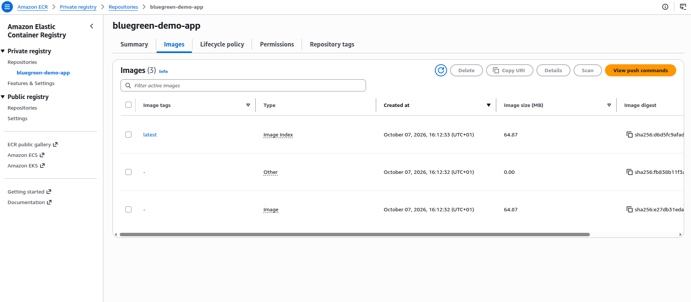

This step can't be skipped, even in the CloudFormation version — the ECS
service you create later needs a real image to exist before it can start
any tasks.

## Step 6 — Load balancer, target groups, and listener rules

1. **EC2 console** → left sidebar **Target Groups**, or follow this
   [**link**](https://us-east-1.console.aws.amazon.com/ec2/home?region=us-east-1#TargetGroups:) → click **Create target group**
2. Target type: **IP addresses**
3. Name: `bluegreen-demo-tg-blue`, Protocol: HTTP, Port: 80, VPC:
   `bluegreen-demo-vpc`
4. Under **Health checks**, leave the path as `/`
5. Click **Next**, then click **Create target group** (skip registering
   targets — ECS will do that automatically once the service exists)
6. Repeat Steps 1–5 for a second one named `bluegreen-demo-tg-green`

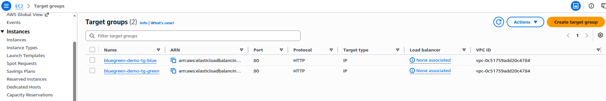

7. Left sidebar → **Load Balancers**, or follow this
   [**link**](https://us-east-1.console.aws.amazon.com/ec2/home?region=us-east-1#LoadBalancers:) → click **Create load balancer**
8. Under **Application Load Balancer**, click **Create**

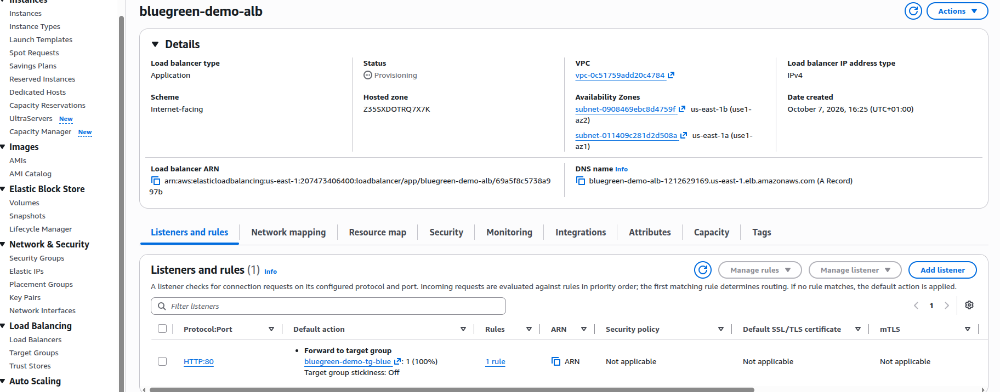

9. Name: `bluegreen-demo-alb`, Scheme: **Internet-facing**
10. Network mapping: VPC `bluegreen-demo-vpc`, select both public subnets
11. Security groups: remove the default one, add `bluegreen-demo-alb-sg`
12. Under **Listeners and routing**, Listener 1 is already HTTP:80 —
    set its default action to forward to `bluegreen-demo-tg-blue` (this is
    just a fallback; the real routing happens through the rules you add
    next)
13. Click **Create load balancer**
14. Once it's created, open the HTTP:80 listener → click **Add rules**

Both the production rule and the test rule live on this **same** listener
— the ECS "Create service" wizard only lets you choose one listener, then
pick two different rules under it, so a second port isn't part of the
picture here. The two rules are told apart by a header instead: normal
requests fall through to the catch-all production rule, and requests
carrying a specific test header get caught by the test rule first.

15. Rule name: `test-rule`
16. Add condition: choose **HTTP Header**, header name `X-Bg-Test`, value
    `true`
17. Action: forward to `bluegreen-demo-tg-green`, then click **Next**
18. Priority: `1`
19. Click **Save**
20. Click the **Add rule** icon again to add the production rule
21. Rule name: `prod-rule`
22. Add condition: **Path** → value `/*`
23. Action: forward to `bluegreen-demo-tg-blue`, then click **Next**
24. Priority: `2` (higher number = checked after the test rule)
25. Click **Save**

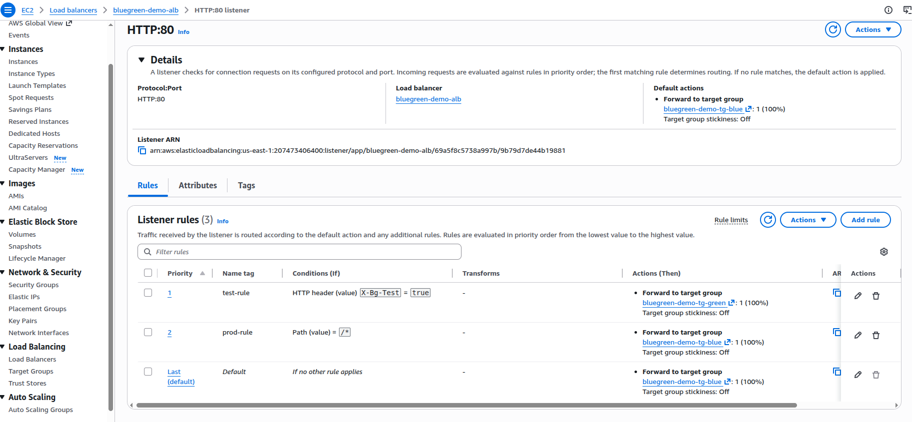

## Step 7 — IAM roles

Go to the [**IAM console**](https://us-east-1.console.aws.amazon.com/iam/home?region=us-east-1#/home) → left sidebar **Roles** → click **Create role**,
for each of these five:

- Trusted entity type: **AWS service**, Use case: search and select
  **Elastic Container Service**, then select **Elastic Container Service
  Task** from the use case list that appears → click **Next** → search
  for and check `AmazonECSTaskExecutionRolePolicy` → click **Next** →
  name it **`bluegreen-demo-task-exec-role`**, click **Create role**
- Trusted entity type: **AWS service**, Use case: search and select
  **Elastic Container Service**, then select **Elastic Container Service
  Task** from the use case list that appears → click **Next** → don't
  attach any policy yet (this demo app doesn't call other AWS services)
  → click **Next** → name it **`bluegreen-demo-task-role`**, click
  **Create role**
- Trusted entity type: **AWS service**, Use case: search for **Elastic
  Container Service**, then choose **"Elastic Container Service for Load
  Balancers"** → click **Next** →
  `AmazonECSInfrastructureRolePolicyForLoadBalancers` should already be
  attached → click **Next** → name it
  **`bluegreen-demo-ecs-infra-role`**, click **Create role**. (This role
  is new — it's what lets ECS itself flip the listener rule between blue
  and green during a deployment, replacing what CodeDeploy's role used
  to do.)
- Trusted entity type: **AWS service**, Use case: search for and select
  **CodeBuild** → click **Next**.

Now attach the actual permissions this role needs, before you ever create
the CodeBuild project — this is the fix for a very common failure where
the pipeline builds fine but `docker push` fails at the Build stage,
because the role CodeBuild auto-generates for you by default only covers
logging and basic artifact access, not ECR. Doing it here, once, means
you never have to come back and patch it later:

- Click **Create inline policy**
- Switch to the **JSON** tab, delete the placeholder content, and paste this:

```json
{
  "Version": "2012-10-17",
  "Statement": [
    {
      "Effect": "Allow",
      "Action": [
        "logs:CreateLogGroup",
        "logs:CreateLogStream",
        "logs:PutLogEvents"
      ],
      "Resource": "*"
    },
    {
      "Effect": "Allow",
      "Action": [
        "s3:GetObject",
        "s3:PutObject",
        "s3:GetBucketAcl",
        "s3:GetBucketLocation"
      ],
      "Resource": "*"
    },
    {
      "Effect": "Allow",
      "Action": "ecr:GetAuthorizationToken",
      "Resource": "*"
    },
    {
      "Effect": "Allow",
      "Action": [
        "ecr:BatchCheckLayerAvailability",
        "ecr:GetDownloadUrlForLayer",
        "ecr:BatchGetImage",
        "ecr:PutImage",
        "ecr:InitiateLayerUpload",
        "ecr:UploadLayerPart",
        "ecr:CompleteLayerUpload"
      ],
      "Resource": "arn:aws:ecr:*:*:repository/bluegreen-demo-app"
    }
  ]
}
```

- Name the policy `bluegreen-demo-codebuild-inline`
- Name the role `bluegreen-demo-codebuild-role`
- Click **Create role**

The S3 permissions use `Resource: "*"` here rather than a specific bucket
ARN, because the pipeline's artifact bucket doesn't exist yet — it gets
created in Step 10. That's loose for a real production setup (worth
tightening to the actual bucket ARN once you know it), fine for getting
this working the first time.

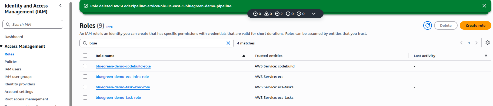

## Step 8 — ECS cluster, task definition, and service

1. **ECS console**, or follow this
   [**link**](https://us-east-1.console.aws.amazon.com/ecs/v2/getStarted?region=us-east-1) → left sidebar **Clusters** → click **Create cluster**
2. Name: `bluegreen-demo-cluster`
3. Infrastructure: check **AWS Fargate (serverless)**
4. Click **Create**
5. Left sidebar → **Task definitions** → click **Create new task definition**
6. Task definition family: `bluegreen-demo-task`
7. Launch type: **AWS Fargate**
8. CPU: `.25 vCPU`, Memory: `0.5 GB`
9. Task role: `bluegreen-demo-task-role`
10. Task execution role: `bluegreen-demo-task-exec-role`
11. Under **Container 1**: name `bluegreen-demo-container`, Image URI:
    paste the ECR image URI from Step 5, Container port: `80`
12. Under **Logging**, turn on **Use log collection**, log group name
    `/ecs/bluegreen-demo`, leave everything else as it is
13. Click **Create**

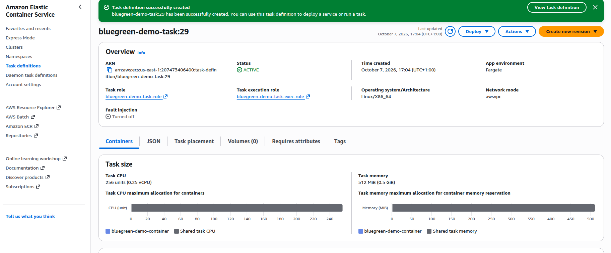

14. Open the cluster `bluegreen-demo-cluster` → click **Create service**
    (or from the task definition page, use the **Deploy** menu →
    **Create service**)
15. Task definition family: `bluegreen-demo-task`, revision: latest
16. Service name: `bluegreen-demo-service`
17. Compute options: **Launch type**, `FARGATE`
18. Desired tasks: `2`
19. Under **Deployment options**, choose **Deployment strategy:
    Blue/green** — this is the setting that replaces what used to
    require a separate CodeDeploy application, don't miss it
20. Under **Deployment bake time**, type `3`. AWS defaults this to 15
    minutes, which makes iterating on a test setup painfully slow — see
    the note right after Step 11 for exactly what this setting does and
    doesn't control before you assume a short bake time is unsafe
21. Under **Deployment lifecycle hooks**, click **Add**. This is the
    part that actually gates production cutover — unlike everything
    above it, which just configures *how* the shift happens, not
    *whether* it's allowed to happen without anyone checking first
22. Choose hook type **Pause**
23. Lifecycle stages: select **PRE_PRODUCTION_TRAFFIC_SHIFT** — this
    pauses right after green has already received test traffic, but
    before it gets anything real
24. Set a timeout — 60 minutes is reasonable for testing. Leave the
    timeout action as **Roll back** (the default): if you forget to
    approve it, an unattended deployment should fail safe and revert,
    not quietly go live on its own
25. Under **Networking**: VPC `bluegreen-demo-vpc`, both public subnets,
    security group `bluegreen-demo-svc-sg`, turn on **Public IP**
26. Under **Load balancing**, choose **Application Load Balancer**
27. Under **Load Balancer Type**, choose **Application Load Balancer**
28. Under **Application Load Balancer**, choose **Use an existing load
    balancer**, then choose `bluegreen-demo-alb`
29. Under **Listener**, click **Use an existing listener**
30. Choose **HTTP:80** — under **Production listener rule** choose
    **Priority: 2**, and under **Test listener rule** choose **Priority: 1**
31. Under the role, choose `bluegreen-demo-ecs-infra-role`
32. Container to load balance: `bluegreen-demo-container 80:80`
33. Target group: `bluegreen-demo-tg-blue`
34. Green target group: `bluegreen-demo-tg-green`
35. Click **Create**

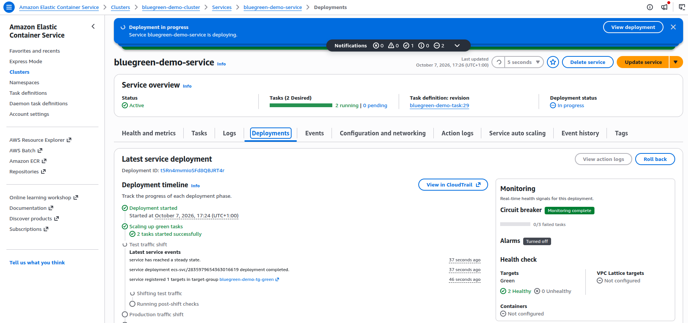

Creating the service kicks off its first deployment, and since manual
approval is on, this first deployment pauses too, just like every one
after it will:

36. Open the ECS service → deployment timeline to watch it progress
    through each phase in real time
37. The deployment should stop at **Test traffic shift**, showing status
    **Awaiting action** — this is the pause hook you just set up

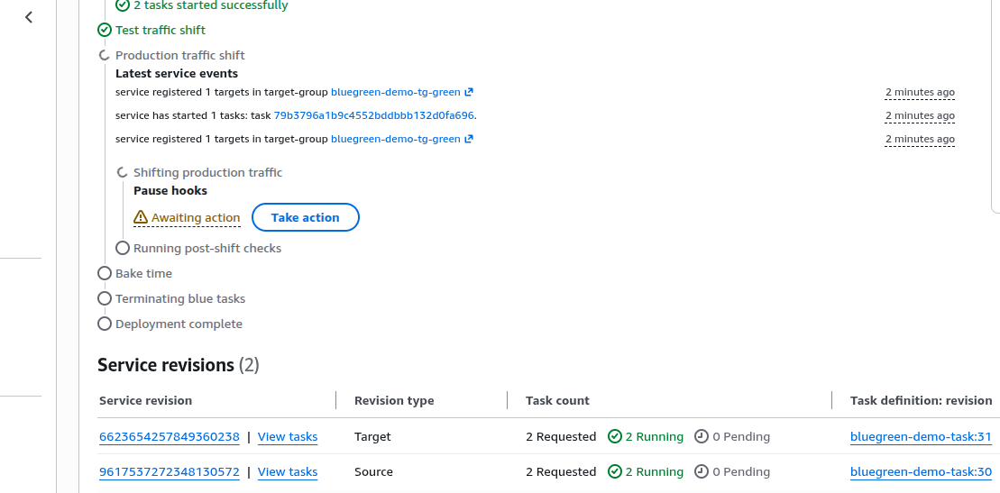

38. Click **Take Action → Continue** to let it proceed to **Production
    traffic shift**

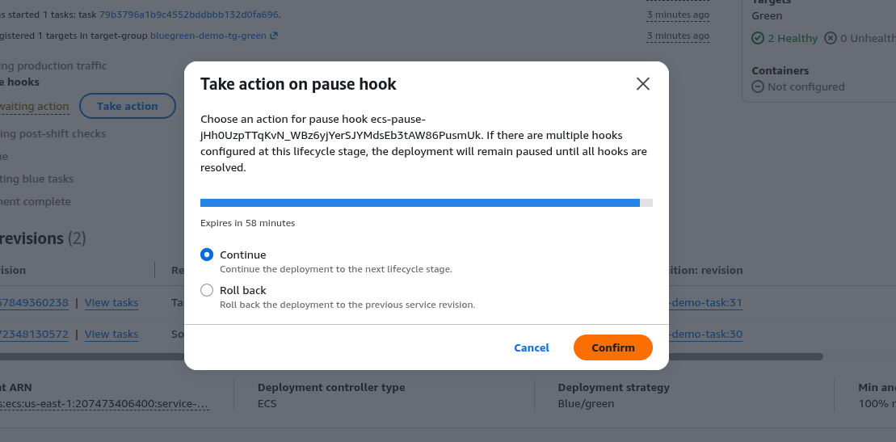

## Step 8a — Confirm the blue environment actually works

Worth stopping here before building the pipeline. Everything from Steps
1–8 is the actual infrastructure — the VPC, security groups, load
balancer, target groups, listener rules, and the service itself. If
something's wrong with any of it, you want to find that out now, not
after you've also added CodeBuild and CodePipeline on top and have to
guess which layer the problem is in.

1. Open the ECS service → wait for both tasks under **Tasks** to show
   status **Running** and health status **Healthy** (give it a minute or
   two after creation)

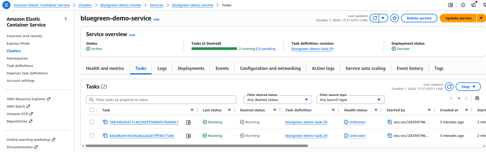

2. Go to the **EC2 console → Load Balancers → `bluegreen-demo-alb`** and
   copy the **DNS name**
3. Open that DNS name in a browser, or run:

```bash
curl http://<alb-dns-name>/
```

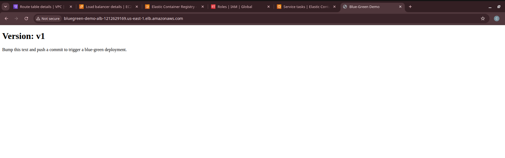

You should see the placeholder page's content (`Version: v1`). If you get
a timeout, a 503, or nothing at all, stop here and check, in this order:
the tasks are actually healthy in the target group (EC2 console → Target
Groups → `bluegreen-demo-tg-blue` → **Targets** tab — both should show
**healthy**, not **unhealthy** or **draining**), the service security
group's outbound rule allows HTTPS (Step 4 — needed to even pull the
image and start), and the production listener rule is actually pointing
at `bluegreen-demo-tg-blue` (Step 6).

Once this works, you know the infrastructure itself is solid, and any
problems from here on are isolated to the pipeline you're about to build.

## Step 9 — CodeBuild project

1. Go to the [**CodeBuild console**](https://us-east-1.console.aws.amazon.com/codesuite/codebuild/projects?region=us-east-1&projects-meta=eyJmIjp7InRleHQiOiIiLCJzaGFyZWQiOmZhbHNlLCJ0YWdnZWQiOmZhbHNlfSwicyI6eyJwcm9wZXJ0eSI6IkxBU1RfTU9ESUZJRURfVElNRSIsImRpcmVjdGlvbiI6LTF9LCJuIjoyMCwiaSI6MH0) → click **Create build project**
2. Project name: `bluegreen-demo-build`
3. Source provider: **GitHub**. Under **Credential**, click **Use
   override credentials for this project only**. Under **Connection**,
   click **Create a new OAuth app token connection**, follow the prompt
   to log in to your GitHub account and save the secret name as anything
   you like. Choose the connection you just created, then paste your
   repo URL into the GitHub Repository field — for example,
   `https://github.com/Gbengard/blue-green-ecs-deployment` — and your
   branch name, for example `main`
4. Environment image: **Managed image**
5. Operating system: **Amazon Linux**
6. Runtime: **Standard**
7. Image: use the latest available standard image
8. Service role: **Existing service role** → select
   `bluegreen-demo-codebuild-role` (the one you built with full
   permissions back in Step 7 — no need to create a new one here, and
   nothing to patch afterward)
9. Check **Enable this flag if you want to build Docker images or want
   your builds to get elevated privileges** — required, since building a
   Docker image inside CodeBuild needs this
10. Expand **Additional configuration**, scroll to **Environment
    variables**, and add these four — the buildspec reads them and the
    build fails (or silently builds a malformed ECR URL) without them:
    - `AWS_REGION` = your region, e.g. `us-east-1`. CodeBuild is supposed
      to provide this automatically as a built-in variable, but in
      practice it didn't always resolve reliably inside the buildspec's
      shell commands — setting it explicitly here removes the ambiguity
      and is cheap insurance against a hard-to-diagnose malformed-URL error
    - `AWS_ACCOUNT_ID` = your 12-digit account ID (run
      `aws sts get-caller-identity --query Account --output text` if you
      don't have it memorized)
    - `ECR_REPO_NAME` = `bluegreen-demo-app`
    - `CONTAINER_NAME` = `bluegreen-demo-container`
11. Buildspec: choose **Use a buildspec file**, path
    `pipeline-config/buildspec.yml`
12. Click **Create build project**

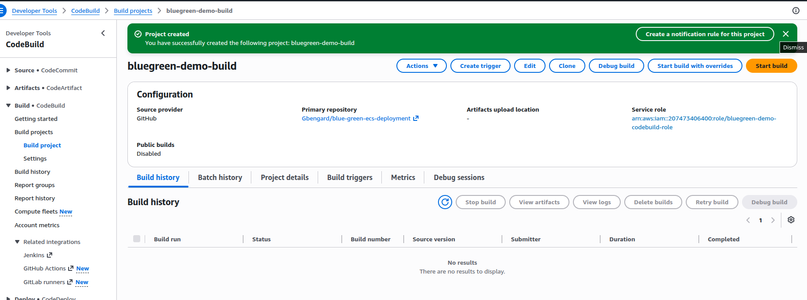

That's it.

## Step 10 — CodePipeline

1. Go to the [**CodePipeline console**](https://us-east-1.console.aws.amazon.com/codesuite/codepipeline/home?region=us-east-1) → click **Create pipeline**
2. Choose **Build custom pipeline** → click **Next**
3. Pipeline name: `bluegreen-demo-pipeline`
4. Execution mode: leave as **Queued** → click **Next**
5. Source provider: **GitHub (via OAuth App)**
6. Click **Connect to GitHub with OAuth** — this opens the authorization
   screen; a person has to click through this manually
7. Once connected, choose your repository and branch → click **Next**
8. Build provider: **AWS CodeBuild**, project: `bluegreen-demo-build` →
   click **Next** twice
9. Deploy provider: **Amazon ECS** (not "Amazon ECS (Blue/Green)" — that
   older option is the CodeDeploy-powered one; plain **Amazon ECS** is
   what you want here, since the service itself already handles the
   blue/green shift)
10. Cluster name: `bluegreen-demo-cluster`
11. Service name: `bluegreen-demo-service`
12. Image definitions file: `imagedefinitions.json` → click **Next**
13. Review everything → click **Create pipeline**

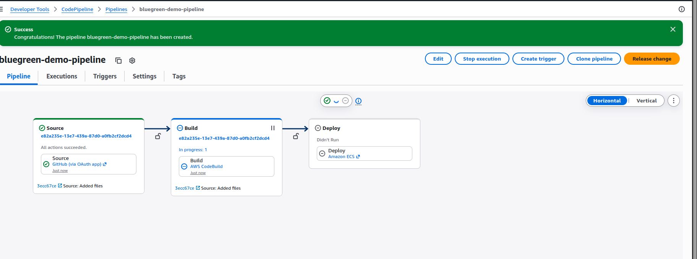

14. The pipeline triggers automatically
15. Go to the ECS service → **Deployments**, and when it asks you to
    **Take Action**, click it, then click **Continue**
16. Wait until the deployment and the pipeline both show successful

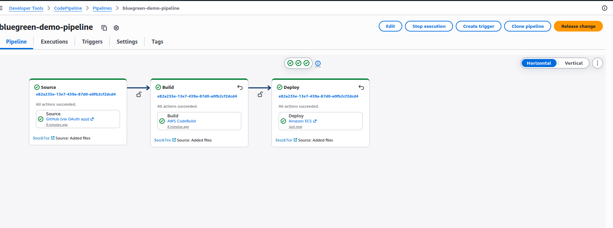

## Step 11 — Test it

1. Push a small change to your GitHub repo (edit the text in
   `pipeline-config/index.html` — change `Version: v1` to `Version: v2`)
2. Watch the pipeline run in the CodePipeline console
3. Open the ECS service → deployment timeline to watch it progress
   through each phase in real time
4. While it's in **Scaling up green tasks** or **Test traffic shift**,
   hit the load balancer URL with the test header set — a browser can't
   add custom headers easily, so use curl:
   `curl -H "X-Bg-Test: true" http://<alb-dns-name>/` — you should see
   the new version there, before it's live

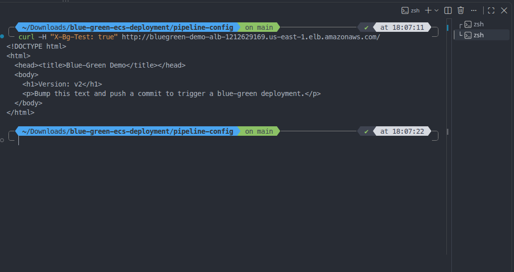

5. The deployment should now stop at **Test traffic shift**, showing
   status **Awaiting action** — this is the pause hook from Step 8
   working. At this point, real traffic is still on the old version;
   confirm that with a plain `curl http://<alb-dns-name>/` (no header) —
   it should still show the old version


6. Once you're satisfied the new version looks right, click **Take
   Action → Continue** to let it proceed to **Production traffic shift**.
   (Or click **Roll back** instead, to see what happens when you reject a
   deployment outright — the new tasks never get production traffic at all)


7. Once it continues, refresh the load balancer's DNS name normally (no
   header) — it should now show the new version

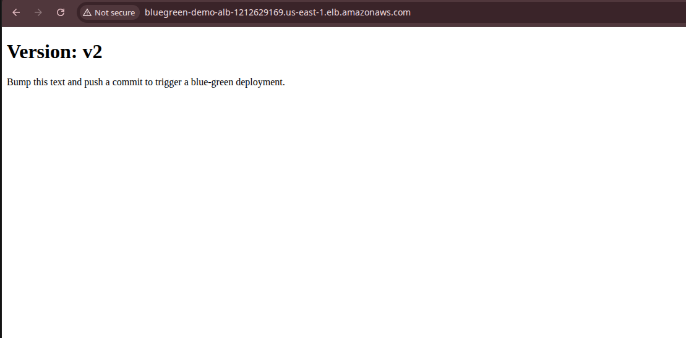

8. For a stronger test, open a terminal and run a loop hitting the URL
   once a second from before you click Continue through to deployment
   complete — watch that it never returns an error, the whole way through
   the swap

### What bake time actually controls (it's not what it sounds like)

It's worth understanding exactly what bake time does and doesn't control,
because the name suggests it should delay something, and it does, just
not the thing you'd guess — and it's easy to conflate it with the manual
approval gate from Step 8, which is a genuinely different mechanism doing
a genuinely different job.

The deployment actually happens in this order:

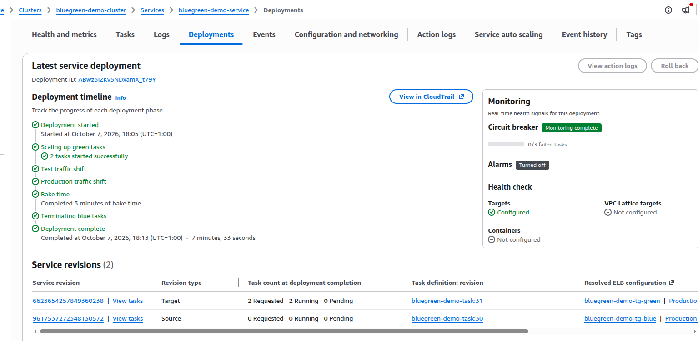

1. New (green) tasks launch and register to the alternate target group
2. As soon as they pass health checks, the **test rule** can reach them —
   immediately, with no delay. This is intentional: the entire point of
   the test rule is to let you validate the new version *before* real
   traffic hits it, so of course it has to be reachable right away
3. **This is where the manual approval hook (Step 8) actually stops
   things** — the deployment pauses here, at `PRE_PRODUCTION_TRAFFIC_SHIFT`,
   and waits for you to click Continue. This is the one genuine gate in
   the whole sequence: nothing proceeds past this point without it
4. Once approved, the **production rule** shifts over to green
5. **Only now does bake time begin** — and all it does is keep the old
   (blue) tasks running for that long, as a fast-rollback safety net,
   before finally terminating them

So bake time and the approval hook are doing two different jobs, on two
different sides of the same moment: the approval hook gates *whether and
when* cutover happens at all; bake time only controls how long the *old*
version sticks around *after* cutover, in case something needs to roll
back quickly. A 3-minute bake time and a 15-minute one behave identically
for how fast your change goes live once approved; the difference only
shows up if something goes wrong shortly after cutover.

If you'd set `EnableManualApproval` to `false` (dropping the hook
entirely), step 3 above wouldn't exist — the production shift would
happen automatically the moment green is healthy, with nothing gating it
at all. That was this project's original behavior, and it's still what
you get if you turn the hook off.

**Is traffic ever split between blue and green while this is happening?
No — not with this project's setup.** ECS actually offers three different
deployment strategies: `BLUE_GREEN`, `LINEAR`, and `CANARY`. Only
`LINEAR` and `CANARY` shift traffic by percentage (for example, `CANARY`
sends 10% of real traffic to green, waits, then shifts the remaining 90%
all at once; `LINEAR` moves it in equal steps over time). Plain
`BLUE_GREEN` — what this project's `DeploymentConfiguration.Strategy` is
actually set to — does none of that. It's a single atomic switch: one
moment production is 100% on blue, the instant green passes its health
checks production becomes 100% on green. There's no window where real
users are being split between old and new. If you specifically want
gradual, percentage-based exposure to real traffic — not just the private
test-header path — that's a different strategy (`LINEAR` or `CANARY`),
not something this `BLUE_GREEN` setup does.

This project *does* now gate the cutover — that's exactly what the
manual approval hook from Step 8 is for, and it's covered in detail in
the "What bake time actually controls" section above. What's still
missing, if you want a bad deployment to be rejected *automatically*
rather than relying on a human to notice and click Reject, is a
CloudWatch alarm attached to the deployment configuration — ECS would
watch it and auto-rollback if it fires. That's not set up here; it's
listed under "What I'd change for a production version" at the end of
this guide.

## Step 12 — Roll back on purpose

Push a change that breaks the health check (for example, edit the task
definition to point at a bad image tag) and watch the ECS service's
deployment fail and keep the blue target group serving traffic. Doing
this once, on purpose, is the only way to actually see a rollback happen
instead of just reading about one.

---

# Manual Teardown (Console)

Delete in this order. AWS will block you if you try to delete something
still in use by another resource — for example, it won't let you delete
a VPC that still has subnets in it.

1. **CodePipeline** — open the pipeline → click **Actions → Delete
   pipeline** → type the pipeline name to confirm → click **Delete**
2. **CodePipeline's S3 artifact bucket** — this one's easy to forget,
   since the console creates it for you automatically and doesn't call
   attention to it again. Go to the
   [**S3 console**](https://us-east-1.console.aws.amazon.com/s3/home?region=us-east-1#)
   and look for a bucket named something like
   `codepipeline-<region>-<random-id>` (or whatever you named it, if you
   specified a custom one when creating the pipeline). Open it, select
   all objects, click **Delete**, type `permanently delete` to confirm,
   then go back and delete the bucket itself the same way. It has to be
   empty before S3 will let you delete it.
3. **CodeBuild** — open the project → **Delete build project** → confirm
4. **Secrets Manager** — go to the
   [**Secrets Manager console**](https://us-east-1.console.aws.amazon.com/secretsmanager/listsecrets?region=us-east-1),
   click the secret CodeBuild created for your GitHub OAuth connection →
   **Actions → Delete** → set the waiting period to 7 days
5. **ECS service** — open the service → click **Delete service** → click
   **Force delete** → type `delete` to confirm
6. **ECS cluster** — once the service is gone, open the cluster → click
   **Delete cluster** → type the cluster name to confirm
7. **Task definitions** — open **Task definitions → bluegreen-demo-task**,
   select all revisions, click **Deregister** (this marks them inactive
   — they'll still show up in the list unless you also permanently delete
   them). To fully remove them: change the filter to **Inactive**, select
   the same revisions, click **Actions → Delete** — this option only
   appears once a revision is already deregistered
8. **Load balancer** — open `bluegreen-demo-alb` → **Actions → Delete
   load balancer** → confirm (delete this first, before the target
   groups, since it's using them)
9. **Target groups** — check `bluegreen-demo-tg-blue` and
   `bluegreen-demo-tg-green`, then **Actions → Delete**
10. **ECR repository** — open `bluegreen-demo-app` → **Delete** → type
    the repository name to confirm (this force-deletes it along with any
    images still inside)
11. **CloudWatch log group** — go to **CloudWatch console → Log
    Management → Log groups**, select `/ecs/bluegreen-demo`, click
    **Actions → Delete log group** → confirm. Nothing else deletes this
    one for you — it sits there quietly running up a small storage cost
    until you remove it yourself
12. **IAM roles** — delete all five roles created in Step 7: select each
    one → **Delete** → type the role name to confirm
13. **Security groups** — delete `bluegreen-demo-svc-sg` first, then
    `bluegreen-demo-alb-sg` (the service one references the ALB one, so
    it has to go first)
14. **VPC networking** — delete both subnets, then the route table, then
    detach and delete the internet gateway, then finally delete the VPC
    itself, using **Actions → Delete** on each one

Go back through the VPC, EC2, ECS, ECR, S3, and CloudWatch consoles
afterward and check nothing was left behind — a resource with a
dependency you missed will sometimes fail quietly instead of showing a
clear error.

---

# Automated Approach (CloudFormation)

Same architecture as above — including ECS's native blue/green
deployment strategy, not CodeDeploy — but split across **two** templates
instead of one, specifically so the two manual steps (authorizing the
GitHub connection, pushing the first image) can happen *before* anything
that depends on them starts running:

- **`cloudformation/00-prerequisites-stack.yaml`** — just the ECR repo
  and the GitHub connection. Deploy this first.
- **`cloudformation/blue-green-ecs-stack.yaml`** — everything else (VPC,
  ALB, ECS service, pipeline). Deploy this second, pointing it at the
  prerequisites stack's outputs.

If you went through the console steps first, most of this will look
familiar — it's the same resources, just as code.

Reminder from the Prerequisites section: you still need the
`pipeline-config` files pushed to your own GitHub repo before the
pipeline will fully work, since it pulls its source from there.

## Full template (main stack)

Save this as `cloudformation/blue-green-ecs-stack.yaml` (it's already in
this repo at that path if you cloned it). The prerequisites template is
short enough to just open directly —
`cloudformation/00-prerequisites-stack.yaml` in this repo.

```yaml
AWSTemplateFormatVersion: "2010-09-09"
Description: >
  Zero-downtime blue-green deployment pipeline for an ECS Fargate service,
  using CodePipeline, CodeBuild, and Amazon ECS's native blue/green
  deployment strategy (no AWS CodeDeploy required — this replaced the
  CodeDeploy-based approach in July 2025).
  Deploy cloudformation/00-prerequisites-stack.yaml FIRST, do the two
  manual steps it requires (authorize the GitHub connection, push an
  initial image to ECR), and only then deploy this stack — see guide.md.
  This stack's ECS service and pipeline both start immediately on
  creation, so if the image or the authorized connection don't already
  exist, you'll hit avoidable failures.

Parameters:
  ProjectName:
    Type: String
    Default: bluegreen-demo
    Description: Short name used to prefix resources. Should match what you used for the prerequisites stack.

  EcrRepositoryName:
    Type: String
    Description: >
      Name of the ECR repository created by the prerequisites stack
      (its EcrRepositoryName output) — not created here.

  GitHubConnectionArn:
    Type: String
    Description: >
      ARN of the CodeStar connection created and authorized via the
      prerequisites stack (its GitHubConnectionArn output) — not created
      here, and must already be authorized before this stack is deployed.

  ContainerPort:
    Type: Number
    Default: 80
    Description: Port your container listens on.

  GitHubRepoOwner:
    Type: String
    Description: GitHub username or org that owns the source repo.

  GitHubRepoName:
    Type: String
    Description: Name of the GitHub repo containing your app + buildspec.yml.

  GitHubBranch:
    Type: String
    Default: main
    Description: Branch CodePipeline should watch.

  BakeTimeMinutes:
    Type: Number
    Default: 3
    Description: >
      Minutes the old (blue) tasks are kept running after production
      traffic cuts over to the new version, in case a rollback is needed.
      AWS's own default is 15 — set lower here so a test deployment
      doesn't leave you waiting around. Worth setting longer again (15+)
      once this is handling anything real, so there's more time to catch
      a problem before the old version is gone for good.

  EnableManualApproval:
    Type: String
    Default: "true"
    AllowedValues: ["true", "false"]
    Description: >
      If true, adds a PAUSE lifecycle hook at PRE_PRODUCTION_TRAFFIC_SHIFT.
      Unlike bake time (which only runs after cutover), this actually
      gates the production traffic shift — the deployment stops and waits
      for a human to approve it, with green reachable via the test header
      the whole time it's waiting. No Lambda or extra IAM role is needed
      for this — PAUSE hooks are a plain ECS/ALB-level feature.

  ApprovalTimeoutMinutes:
    Type: Number
    Default: 60
    Description: >
      How long the deployment waits for approval before taking the
      timeout action below automatically. Max allowed by ECS is 20160
      (14 days).

  ApprovalTimeoutAction:
    Type: String
    Default: ROLLBACK
    AllowedValues: ["ROLLBACK", "CONTINUE"]
    Description: >
      What happens if nobody approves within ApprovalTimeoutMinutes.
      ROLLBACK (AWS's own default) means an unattended deployment reverts
      safely rather than quietly going live — recommended over CONTINUE
      for exactly that reason.

Conditions:
  UseManualApproval: !Equals [!Ref EnableManualApproval, "true"]

Resources:

  ##########################################################################
  # NETWORKING
  ##########################################################################

  VPC:
    Type: AWS::EC2::VPC
    Properties:
      CidrBlock: 10.20.0.0/16
      EnableDnsSupport: true
      EnableDnsHostnames: true
      Tags:
        - Key: Name
          Value: !Sub "${ProjectName}-vpc"

  InternetGateway:
    Type: AWS::EC2::InternetGateway

  AttachGateway:
    Type: AWS::EC2::VPCGatewayAttachment
    Properties:
      VpcId: !Ref VPC
      InternetGatewayId: !Ref InternetGateway

  PublicSubnetA:
    Type: AWS::EC2::Subnet
    Properties:
      VpcId: !Ref VPC
      CidrBlock: 10.20.1.0/24
      AvailabilityZone: !Select [0, !GetAZs ""]
      MapPublicIpOnLaunch: true
      Tags:
        - Key: Name
          Value: !Sub "${ProjectName}-public-a"

  PublicSubnetB:
    Type: AWS::EC2::Subnet
    Properties:
      VpcId: !Ref VPC
      CidrBlock: 10.20.2.0/24
      AvailabilityZone: !Select [1, !GetAZs ""]
      MapPublicIpOnLaunch: true
      Tags:
        - Key: Name
          Value: !Sub "${ProjectName}-public-b"

  PublicRouteTable:
    Type: AWS::EC2::RouteTable
    Properties:
      VpcId: !Ref VPC

  PublicRoute:
    Type: AWS::EC2::Route
    DependsOn: AttachGateway
    Properties:
      RouteTableId: !Ref PublicRouteTable
      DestinationCidrBlock: 0.0.0.0/0
      GatewayId: !Ref InternetGateway

  PublicSubnetARouteAssoc:
    Type: AWS::EC2::SubnetRouteTableAssociation
    Properties:
      SubnetId: !Ref PublicSubnetA
      RouteTableId: !Ref PublicRouteTable

  PublicSubnetBRouteAssoc:
    Type: AWS::EC2::SubnetRouteTableAssociation
    Properties:
      SubnetId: !Ref PublicSubnetB
      RouteTableId: !Ref PublicRouteTable

  # NOTE: production setups should use private subnets + a NAT Gateway.
  # This template uses public subnets with public IPs on the tasks to
  # keep the demo simpler and cheaper to run.

  ##########################################################################
  # SECURITY GROUPS
  ##########################################################################

  AlbSecurityGroup:
    Type: AWS::EC2::SecurityGroup
    Properties:
      GroupDescription: Allow HTTP inbound to the ALB
      VpcId: !Ref VPC
      SecurityGroupIngress:
        - IpProtocol: tcp
          FromPort: 80
          ToPort: 80
          CidrIp: 0.0.0.0/0

  ServiceSecurityGroup:
    Type: AWS::EC2::SecurityGroup
    Properties:
      GroupDescription: Allow traffic from the ALB to the ECS tasks
      VpcId: !Ref VPC
      SecurityGroupIngress:
        - IpProtocol: tcp
          FromPort: !Ref ContainerPort
          ToPort: !Ref ContainerPort
          SourceSecurityGroupId: !Ref AlbSecurityGroup
      SecurityGroupEgress:
        # Explicit on purpose. Fargate needs to reach the ECR API and the
        # ECR image layer store (both HTTPS) to pull the image, and
        # CloudWatch Logs (also HTTPS) to ship container logs. Without
        # this, tasks fail to start with
        # "ResourceInitializationError: unable to pull secrets or registry
        # auth ... dial tcp ... i/o timeout" — the task can resolve the
        # address but the security group silently drops the connection.
        - IpProtocol: tcp
          FromPort: 443
          ToPort: 443
          CidrIp: 0.0.0.0/0
          Description: HTTPS out - required to reach ECR, CloudWatch Logs, and STS

  ##########################################################################
  # LOAD BALANCER — blue (primary) + green (alternate) target groups,
  # plus a production listener rule and test listener rule. ECS's native
  # blue/green deployment flips which target group each RULE points to —
  # that's why we need explicit rules, not just listener default actions.
  ##########################################################################

  ApplicationLoadBalancer:
    Type: AWS::ElasticLoadBalancingV2::LoadBalancer
    # Explicit dependency, not implicit: this resource only references
    # subnets and a security group, so CloudFormation has no natural
    # reason to wait for the Internet Gateway to actually be attached to
    # the VPC first — without this, ALB creation can race the attachment
    # and fail with "VPC has no internet gateway" roughly half the time.
    DependsOn: AttachGateway
    Properties:
      Name: !Sub "${ProjectName}-alb"
      Subnets:
        - !Ref PublicSubnetA
        - !Ref PublicSubnetB
      SecurityGroups:
        - !Ref AlbSecurityGroup
      Scheme: internet-facing
      Type: application

  BlueTargetGroup:
    Type: AWS::ElasticLoadBalancingV2::TargetGroup
    Properties:
      Name: !Sub "${ProjectName}-tg-blue"
      Port: !Ref ContainerPort
      Protocol: HTTP
      VpcId: !Ref VPC
      TargetType: ip
      HealthCheckPath: /
      HealthCheckIntervalSeconds: 15
      HealthyThresholdCount: 2
      UnhealthyThresholdCount: 3

  GreenTargetGroup:
    Type: AWS::ElasticLoadBalancingV2::TargetGroup
    Properties:
      Name: !Sub "${ProjectName}-tg-green"
      Port: !Ref ContainerPort
      Protocol: HTTP
      VpcId: !Ref VPC
      TargetType: ip
      HealthCheckPath: /
      HealthCheckIntervalSeconds: 15
      HealthyThresholdCount: 2
      UnhealthyThresholdCount: 3

  # A single listener carries both rules. The ECS "Create service" console
  # wizard only lets you pick a production rule and a test rule from the
  # SAME listener — it doesn't offer a second listener/port for test
  # traffic — so the two rules have to be told apart by something other
  # than the port. Here, the test rule matches a custom header; anything
  # without that header falls through to the catch-all production rule.
  ProdListener:
    Type: AWS::ElasticLoadBalancingV2::Listener
    Properties:
      LoadBalancerArn: !Ref ApplicationLoadBalancer
      Port: 80
      Protocol: HTTP
      DefaultActions:
        - Type: fixed-response
          FixedResponseConfig:
            StatusCode: "404"
            ContentType: text/plain
            MessageBody: "No matching rule"
      # The default action above is just a fallback. The two rules below
      # are what ECS actually manages and flips between blue and green.

  # Priority 1 = evaluated first. Matches only requests carrying the test
  # header, so it never intercepts normal traffic.
  TestListenerRule:
    Type: AWS::ElasticLoadBalancingV2::ListenerRule
    Properties:
      ListenerArn: !Ref ProdListener
      Priority: 1
      Conditions:
        - Field: http-header
          HttpHeaderConfig:
            HttpHeaderName: X-Bg-Test
            Values: ["true"]
      Actions:
        - Type: forward
          TargetGroupArn: !Ref GreenTargetGroup

  # Priority 2 = evaluated second, catches everything else. This is the
  # one real users hit.
  ProdListenerRule:
    Type: AWS::ElasticLoadBalancingV2::ListenerRule
    Properties:
      ListenerArn: !Ref ProdListener
      Priority: 2
      Conditions:
        - Field: path-pattern
          Values: ["/*"]
      Actions:
        - Type: forward
          TargetGroupArn: !Ref BlueTargetGroup

  ##########################################################################
  # ECS (the ECR repo itself lives in the prerequisites stack — this one
  # just references it by name via the EcrRepositoryName parameter)
  ##########################################################################

  EcsCluster:
    Type: AWS::ECS::Cluster
    Properties:
      ClusterName: !Sub "${ProjectName}-cluster"

  TaskExecutionRole:
    Type: AWS::IAM::Role
    Properties:
      RoleName: !Sub "${ProjectName}-task-exec-role"
      AssumeRolePolicyDocument:
        Version: "2012-10-17"
        Statement:
          - Effect: Allow
            Principal:
              Service: ecs-tasks.amazonaws.com
            Action: sts:AssumeRole
      ManagedPolicyArns:
        - arn:aws:iam::aws:policy/service-role/AmazonECSTaskExecutionRolePolicy

  TaskRole:
    Type: AWS::IAM::Role
    Properties:
      RoleName: !Sub "${ProjectName}-task-role"
      AssumeRolePolicyDocument:
        Version: "2012-10-17"
        Statement:
          - Effect: Allow
            Principal:
              Service: ecs-tasks.amazonaws.com
            Action: sts:AssumeRole
      # Add permissions here if your app needs to call other AWS services.
      # Left empty on purpose for this demo.

  # Native ECS blue/green needs this role so ECS itself can flip the
  # listener rule between the blue and green target groups during a
  # deployment. This is new — CodeDeploy used to do this using its own role.
  EcsInfrastructureRole:
    Type: AWS::IAM::Role
    Properties:
      RoleName: !Sub "${ProjectName}-ecs-infra-role"
      AssumeRolePolicyDocument:
        Version: "2012-10-17"
        Statement:
          - Effect: Allow
            Principal:
              Service: ecs.amazonaws.com
            Action: sts:AssumeRole
      ManagedPolicyArns:
        - arn:aws:iam::aws:policy/AmazonECSInfrastructureRolePolicyForLoadBalancers

  TaskDefinition:
    Type: AWS::ECS::TaskDefinition
    Properties:
      Family: !Sub "${ProjectName}-task"
      RequiresCompatibilities:
        - FARGATE
      NetworkMode: awsvpc
      Cpu: "256"
      Memory: "512"
      ExecutionRoleArn: !GetAtt TaskExecutionRole.Arn
      TaskRoleArn: !GetAtt TaskRole.Arn
      ContainerDefinitions:
        - Name: !Sub "${ProjectName}-container"
          # CodeBuild pushes real images to this repo on each pipeline run.
          # A valid image must already exist (pushed as part of the
          # prerequisites stack's manual steps) before this service can
          # start — see guide.md.
          Image: !Sub "${AWS::AccountId}.dkr.ecr.${AWS::Region}.amazonaws.com/${EcrRepositoryName}:latest"
          PortMappings:
            - ContainerPort: !Ref ContainerPort
          LogConfiguration:
            LogDriver: awslogs
            Options:
              awslogs-group: !Ref EcsLogGroup
              awslogs-region: !Ref AWS::Region
              awslogs-stream-prefix: ecs

  EcsLogGroup:
    Type: AWS::Logs::LogGroup
    Properties:
      LogGroupName: !Sub "/ecs/${ProjectName}"
      RetentionInDays: 14

  EcsService:
    Type: AWS::ECS::Service
    DependsOn:
      - ProdListenerRule
      - TestListenerRule
    Properties:
      ServiceName: !Sub "${ProjectName}-service"
      Cluster: !Ref EcsCluster
      TaskDefinition: !Ref TaskDefinition
      DesiredCount: 2
      LaunchType: FARGATE
      NetworkConfiguration:
        AwsvpcConfiguration:
          AssignPublicIp: ENABLED
          Subnets:
            - !Ref PublicSubnetA
            - !Ref PublicSubnetB
          SecurityGroups:
            - !Ref ServiceSecurityGroup
      LoadBalancers:
        - ContainerName: !Sub "${ProjectName}-container"
          ContainerPort: !Ref ContainerPort
          TargetGroupArn: !Ref BlueTargetGroup
          AdvancedConfiguration:
            AlternateTargetGroupArn: !Ref GreenTargetGroup
            ProductionListenerRule: !Ref ProdListenerRule
            TestListenerRule: !Ref TestListenerRule
            RoleArn: !GetAtt EcsInfrastructureRole.Arn
      DeploymentConfiguration:
        Strategy: BLUE_GREEN
        BakeTimeInMinutes: !Ref BakeTimeMinutes
        MaximumPercent: 200
        MinimumHealthyPercent: 100
        LifecycleHooks: !If
          - UseManualApproval
          - - LifecycleStages:
                - PRE_PRODUCTION_TRAFFIC_SHIFT
              TargetType: PAUSE
              TimeoutConfiguration:
                TimeoutInMinutes: !Ref ApprovalTimeoutMinutes
                Action: !Ref ApprovalTimeoutAction
          - !Ref AWS::NoValue

  ##########################################################################
  # CODEBUILD
  ##########################################################################

  CodeBuildServiceRole:
    Type: AWS::IAM::Role
    Properties:
      RoleName: !Sub "${ProjectName}-codebuild-role"
      AssumeRolePolicyDocument:
        Version: "2012-10-17"
        Statement:
          - Effect: Allow
            Principal:
              Service: codebuild.amazonaws.com
            Action: sts:AssumeRole
      Policies:
        - PolicyName: !Sub "${ProjectName}-codebuild-policy"
          PolicyDocument:
            Version: "2012-10-17"
            Statement:
              - Effect: Allow
                Action:
                  - logs:CreateLogGroup
                  - logs:CreateLogStream
                  - logs:PutLogEvents
                Resource: "*"
              - Effect: Allow
                Action:
                  - ecr:GetAuthorizationToken
                Resource: "*"
              - Effect: Allow
                Action:
                  - ecr:BatchCheckLayerAvailability
                  - ecr:GetDownloadUrlForLayer
                  - ecr:BatchGetImage
                  - ecr:PutImage
                  - ecr:InitiateLayerUpload
                  - ecr:UploadLayerPart
                  - ecr:CompleteLayerUpload
                # Constructed, not !GetAtt — the repo is a parameter here,
                # not a resource this stack created.
                Resource: !Sub "arn:aws:ecr:${AWS::Region}:${AWS::AccountId}:repository/${EcrRepositoryName}"
              - Effect: Allow
                Action:
                  - s3:GetObject
                  - s3:PutObject
                  - s3:GetBucketAcl
                  - s3:GetBucketLocation
                Resource:
                  - !Sub "${ArtifactBucket.Arn}"
                  - !Sub "${ArtifactBucket.Arn}/*"

  CodeBuildProject:
    Type: AWS::CodeBuild::Project
    Properties:
      Name: !Sub "${ProjectName}-build"
      ServiceRole: !GetAtt CodeBuildServiceRole.Arn
      Artifacts:
        Type: CODEPIPELINE
      Environment:
        Type: LINUX_CONTAINER
        ComputeType: BUILD_GENERAL1_SMALL
        Image: aws/codebuild/amazonlinux2-x86_64-standard:5.0
        PrivilegedMode: true # required to build Docker images
        EnvironmentVariables:
          # AWS_REGION is normally provided automatically by CodeBuild.
          # It's set explicitly here anyway — in practice it didn't
          # reliably resolve inside buildspec shell commands on every
          # account/image combination, and an empty value here silently
          # produces a malformed ECR URL rather than a clear error.
          - Name: AWS_REGION
            Value: !Ref AWS::Region
          - Name: AWS_ACCOUNT_ID
            Value: !Ref AWS::AccountId
          - Name: ECR_REPO_NAME
            Value: !Ref EcrRepositoryName
          - Name: CONTAINER_NAME
            Value: !Sub "${ProjectName}-container"
      Source:
        Type: CODEPIPELINE
        BuildSpec: pipeline-config/buildspec.yml

  ##########################################################################
  # CODEPIPELINE
  ##########################################################################

  ArtifactBucket:
    Type: AWS::S3::Bucket
    Properties:
      BucketName: !Sub "${ProjectName}-pipeline-artifacts-${AWS::AccountId}"
      VersioningConfiguration:
        Status: Enabled

  CodePipelineServiceRole:
    Type: AWS::IAM::Role
    Properties:
      RoleName: !Sub "${ProjectName}-pipeline-role"
      AssumeRolePolicyDocument:
        Version: "2012-10-17"
        Statement:
          - Effect: Allow
            Principal:
              Service: codepipeline.amazonaws.com
            Action: sts:AssumeRole
      Policies:
        - PolicyName: !Sub "${ProjectName}-pipeline-policy"
          PolicyDocument:
            Version: "2012-10-17"
            Statement:
              - Effect: Allow
                Action:
                  - s3:GetObject
                  - s3:PutObject
                  - s3:GetBucketVersioning
                Resource:
                  - !Sub "${ArtifactBucket.Arn}"
                  - !Sub "${ArtifactBucket.Arn}/*"
              - Effect: Allow
                Action:
                  - codestar-connections:UseConnection
                Resource: !Ref GitHubConnectionArn
              - Effect: Allow
                Action:
                  - codebuild:BatchGetBuilds
                  - codebuild:StartBuild
                Resource: !GetAtt CodeBuildProject.Arn
              - Effect: Allow
                Action:
                  - ecs:DescribeServices
                  - ecs:DescribeTaskDefinition
                  - ecs:RegisterTaskDefinition
                  - ecs:UpdateService
                Resource: "*"
              - Effect: Allow
                Action:
                  - iam:PassRole
                Resource:
                  - !GetAtt TaskExecutionRole.Arn
                  - !GetAtt TaskRole.Arn

  Pipeline:
    Type: AWS::CodePipeline::Pipeline
    Properties:
      Name: !Sub "${ProjectName}-pipeline"
      RoleArn: !GetAtt CodePipelineServiceRole.Arn
      ArtifactStore:
        Type: S3
        Location: !Ref ArtifactBucket
      Stages:
        - Name: Source
          Actions:
            - Name: Source
              ActionTypeId:
                Category: Source
                Owner: AWS
                Provider: CodeStarSourceConnection
                Version: "1"
              Configuration:
                ConnectionArn: !Ref GitHubConnectionArn
                FullRepositoryId: !Sub "${GitHubRepoOwner}/${GitHubRepoName}"
                BranchName: !Ref GitHubBranch
              OutputArtifacts:
                - Name: SourceOutput

        - Name: Build
          Actions:
            - Name: Build
              ActionTypeId:
                Category: Build
                Owner: AWS
                Provider: CodeBuild
                Version: "1"
              Configuration:
                ProjectName: !Ref CodeBuildProject
              InputArtifacts:
                - Name: SourceOutput
              OutputArtifacts:
                - Name: BuildOutput

        # Standard ECS deploy action — not CodeDeployToECS. This just
        # registers a new task definition revision with the updated image
        # and calls UpdateService. Because the service's own
        # DeploymentConfiguration.Strategy is BLUE_GREEN, ECS itself does
        # the blue/green shift — the pipeline doesn't need to know or care.
        - Name: Deploy
          Actions:
            - Name: Deploy
              ActionTypeId:
                Category: Deploy
                Owner: AWS
                Provider: ECS
                Version: "1"
              Configuration:
                ClusterName: !Ref EcsCluster
                ServiceName: !GetAtt EcsService.Name
                FileName: imagedefinitions.json
              InputArtifacts:
                - Name: BuildOutput

Outputs:
  LoadBalancerUrl:
    Description: Public URL of the app once deployed
    Value: !Sub "http://${ApplicationLoadBalancer.DNSName}"

  LoadBalancerTestNote:
    Description: >
      There's no separate test port. Hit the same URL with header
      'X-Bg-Test: true' (e.g. curl -H "X-Bg-Test: true" http://<this-url>/)
      to reach the green revision before it goes live.
    Value: !Sub "http://${ApplicationLoadBalancer.DNSName}"

  EcrRepositoryUri:
    Description: Where this stack's pipeline pushes images (created by the prerequisites stack)
    Value: !Sub "${AWS::AccountId}.dkr.ecr.${AWS::Region}.amazonaws.com/${EcrRepositoryName}"

  PipelineName:
    Value: !Ref Pipeline

  EcsClusterName:
    Value: !Ref EcsCluster

  EcsServiceName:
    Value: !GetAtt EcsService.Name
```

## Deploy it — two stacks, in order

The ECS service and the pipeline in the main stack both start trying to
work the moment the stack finishes creating — the service starts placing
tasks, the pipeline's Source stage starts polling GitHub. Neither of
those can actually succeed until an image exists in ECR and the GitHub
connection is authorized. So rather than create everything at once and
watch it fail predictably, deploy a small prerequisites stack first, do
the two manual steps against it, *then* deploy the main stack — by which
point everything it needs already exists.

### Stage 1 — prerequisites stack (ECR repo + GitHub connection)

```bash
aws cloudformation create-stack \
  --stack-name bluegreen-demo-prereqs \
  --template-body file://cloudformation/00-prerequisites-stack.yaml \
  --parameters ParameterKey=ProjectName,ParameterValue=bluegreen-demo

aws cloudformation wait stack-create-complete --stack-name bluegreen-demo-prereqs
```

Grab its outputs — you'll need these for both the manual steps below and
Stage 2:

```bash
aws cloudformation describe-stacks --stack-name bluegreen-demo-prereqs --query 'Stacks[0].Outputs'
```

### Stage 2 — the two manual steps (now, before the main stack exists)

These aren't gaps in either template — AWS deliberately requires a human
for both, for security reasons.

**1. Authorize the GitHub connection.** Go to the **Developer Tools**
console → **Settings → Connections** in the left sidebar → find
`bluegreen-demo-github-connection` (status **Pending**) → click it →
click **Update pending connection** → follow the GitHub authorization
prompt → click **Connect**.

**2. Push the first image to ECR.**

```bash
ACCOUNT_ID=$(aws sts get-caller-identity --query Account --output text)
REGION=$(aws configure get region)

aws ecr get-login-password --region $REGION | docker login --username AWS --password-stdin $ACCOUNT_ID.dkr.ecr.$REGION.amazonaws.com
docker build -t bluegreen-demo-app pipeline-config/
docker tag bluegreen-demo-app:latest $ACCOUNT_ID.dkr.ecr.$REGION.amazonaws.com/bluegreen-demo-app:latest
docker push $ACCOUNT_ID.dkr.ecr.$REGION.amazonaws.com/bluegreen-demo-app:latest
```

Both of these can happen in either order relative to each other — just
both before Stage 3.

### Stage 3 — the main stack

Now take the `GitHubConnectionArn` and `EcrRepositoryName` values from
the prerequisites stack's outputs and pass them in here:

```bash
CONN_ARN=$(aws cloudformation describe-stacks --stack-name bluegreen-demo-prereqs \
  --query "Stacks[0].Outputs[?OutputKey=='GitHubConnectionArn'].OutputValue" --output text)
ECR_NAME=$(aws cloudformation describe-stacks --stack-name bluegreen-demo-prereqs \
  --query "Stacks[0].Outputs[?OutputKey=='EcrRepositoryName'].OutputValue" --output text)

aws cloudformation create-stack \
  --stack-name bluegreen-demo \
  --template-body file://cloudformation/blue-green-ecs-stack.yaml \
  --capabilities CAPABILITY_NAMED_IAM \
  --parameters \
      ParameterKey=ProjectName,ParameterValue=bluegreen-demo \
      ParameterKey=EcrRepositoryName,ParameterValue=$ECR_NAME \
      ParameterKey=GitHubConnectionArn,ParameterValue=$CONN_ARN \
      ParameterKey=GitHubRepoOwner,ParameterValue=<your-github-username> \
      ParameterKey=GitHubRepoName,ParameterValue=<your-repo-name> \
      ParameterKey=GitHubBranch,ParameterValue=main \
      ParameterKey=BakeTimeMinutes,ParameterValue=3 \
      ParameterKey=EnableManualApproval,ParameterValue=true \
      ParameterKey=ApprovalTimeoutMinutes,ParameterValue=60 \
      ParameterKey=ApprovalTimeoutAction,ParameterValue=ROLLBACK

aws cloudformation wait stack-create-complete --stack-name bluegreen-demo
```

`BakeTimeMinutes` defaults to 3 — AWS's own default is 15, a long wait
while you're iterating. `EnableManualApproval` defaults to `true`, adding
a `PAUSE` hook at `PRE_PRODUCTION_TRAFFIC_SHIFT` — no Lambda or extra IAM
role needed, it's a plain ECS feature. Set it to `false` if you'd rather
the deployment shift to production automatically the moment green is
healthy, with nothing waiting on anyone. `ApprovalTimeoutAction` defaults
to `ROLLBACK`, meaning a deployment nobody approves in time reverts
safely rather than quietly going live. See the note after Step 11 in the
console section for exactly how this hook and bake time relate to each
other — they gate two different moments, not the same one.

By the time this stack finishes creating, the image already exists and
the connection is already authorized — the ECS service should start
tasks successfully on the first try, and the pipeline's Source stage
should work the first time you push a commit, with none of the
expected-but-confusing-looking failures you'd get from creating
everything in one shot.

## Check what you got

```bash
aws cloudformation describe-stacks --stack-name bluegreen-demo --query 'Stacks[0].Outputs'
```

This prints the ALB URL, pipeline name, and ECS cluster/service names, so
you don't have to go hunting through the console. There's no separate
test URL — the same URL serves both blue and green, told apart by a
header (see below).

## Test it

Push a commit to your GitHub repo, watch the pipeline run, then confirm
zero downtime during the swap. While the deployment is running, you can
also check the new (green) version privately before it goes live, using
the `X-Bg-Test: true` header:

```bash
ALB_DNS=$(aws cloudformation describe-stacks --stack-name bluegreen-demo \
  --query "Stacks[0].Outputs[?OutputKey=='LoadBalancerUrl'].OutputValue" --output text)

# Check the new version privately, before it's live:
curl -H "X-Bg-Test: true" $ALB_DNS/

# Confirm zero downtime for real users during the swap:
while true; do curl -s -o /dev/null -w "%{http_code} " $ALB_DNS/; sleep 1; done
```

You should see `200` the whole way through the deploy, with nothing else
mixed in. That's the actual proof this works, not just a green checkmark
in the console.

---

# Automated Teardown (CloudFormation)

Two stacks were created, so two need deleting — **main stack first, then
prerequisites**. Deleting them in the other order will leave the main
stack's pipeline referencing a GitHub connection that no longer exists,
and its deployments referencing an ECR repo that no longer exists.

Unlike the manual teardown, you don't need separate steps for the
CloudWatch log group or the task definition — both are resources
CloudFormation created as part of the main stack (`EcsLogGroup` and
`TaskDefinition`), so `delete-stack` removes them along with everything
else. The task definition gets deregistered, not permanently deleted —
if you want it fully gone rather than just inactive, that's an optional
extra step at the end of this section.

## Step 1 — Empty the S3 artifact bucket

CloudFormation refuses to delete a non-empty bucket. Versioning was
turned on for this one, so a normal delete leaves old versions behind —
this clears those too.

```bash
aws s3 rm s3://bluegreen-demo-artifacts-$ACCOUNT_ID --recursive
aws s3api delete-objects --bucket bluegreen-demo-artifacts-$ACCOUNT_ID \
  --delete "$(aws s3api list-object-versions --bucket bluegreen-demo-artifacts-$ACCOUNT_ID \
  --query '{Objects: Versions[].{Key:Key,VersionId:VersionId}}')" 2>/dev/null || true
```

## Step 2 — Delete the main stack

```bash
aws cloudformation delete-stack --stack-name bluegreen-demo
aws cloudformation wait stack-delete-complete --stack-name bluegreen-demo
```

Or in the console: open the stack → click **Delete** → confirm in the dialog.

## Step 3 — Empty the ECR repository

This lives in the prerequisites stack now, so it's handled separately,
after the main stack is gone (nothing in the main stack needs it anymore
at this point).

```bash
aws ecr batch-delete-image --repository-name bluegreen-demo-app \
  --image-ids "$(aws ecr list-images --repository-name bluegreen-demo-app --query 'imageIds' --output json)"
```

## Step 4 — Delete the prerequisites stack

```bash
aws cloudformation delete-stack --stack-name bluegreen-demo-prereqs
aws cloudformation wait stack-delete-complete --stack-name bluegreen-demo-prereqs
```

This removes the ECR repo and the GitHub connection together — no need
to delete the connection separately, CloudFormation still owns and
tracks it even though you authorized it by hand.

## Step 5 — Confirm both are gone

```bash
aws cloudformation describe-stacks --stack-name bluegreen-demo
aws cloudformation describe-stacks --stack-name bluegreen-demo-prereqs
```

Both should return a "does not exist" error once deletion finishes. If
either is stuck in `DELETE_FAILED`, check that stack's **Events** tab to
see which resource blocked it — for the main stack it's almost always the
S3 bucket not being fully empty; for the prerequisites stack, almost
always the ECR repo still having images in it.

---

## Cost note

This stack costs money the whole time it's running — mainly the load
balancer and the Fargate tasks. Build it, test it, screenshot what you
need, then tear it down rather than leaving it up. Set a billing alarm
before you start, just in case something doesn't get cleaned up the way
you expect.

## What I'd change for a production version

- Private subnets with a NAT Gateway, instead of public subnets with
  public IPs on the tasks
- Tighter IAM policies — the CodeBuild and CodePipeline roles here are
  broader than they'd need to be in a real setup
- HTTPS on the load balancer with a real certificate, not plain HTTP
- A CloudWatch alarm attached to the deployment configuration, so a spike
  in errors during bake time triggers an automatic rollback — right now
  the manual approval hook gates the *initial* cutover, but once bake
  time starts, nothing but target group health checks is watching for
  problems
- A Lambda-type lifecycle hook running an actual automated check (hit a
  `/health` endpoint, check a key metric) at `PRE_PRODUCTION_TRAFFIC_SHIFT`
  instead of — or alongside — a human manually deciding. The manual
  approval hook built here is a real gate, but it's only as good as
  whoever's watching for the Awaiting Action status; a real production
  setup likely wants both an automated check and a human able to
  override it
- A longer bake time for anything handling real traffic, so there's more
  time to notice a problem before the old version terminates

---

## Troubleshooting: real errors people hit building this

These are actual errors hit while building this project, kept here with
their real fixes rather than buried in a changelog somewhere.

**CodeBuild project's Source shows "GitHub" instead of "CodePipeline" (or
vice versa, and you're not sure which is right)**
When this project is being used inside a pipeline's Build stage,
`CodePipeline` is the correct source provider — the pipeline's own Source
stage connects to GitHub and hands this project an artifact; the project
itself shouldn't also be configured to fetch from GitHub independently.
If you see "GitHub" instead and the build is working anyway, that's
because CodePipeline overrides a project's own source settings at
invocation time when it's used as a pipeline action — so it was likely
still functioning correctly, just configured in a way that's only
correct *because* of that override, rather than being correct on its own.
Worth fixing for clarity even if nothing was actually broken.

**`permission denied while trying to connect to the Docker API at
unix:///var/run/docker.sock`**
Local machine issue, nothing to do with this project. Your user isn't in
the `docker` group. Fix: `sudo usermod -aG docker $USER`, then fully log
out and back in.

**`$AWS_ACCOUNT_ID`, `$ECR_REPO_NAME`, `$CONTAINER_NAME` come back empty
in the build**
If you built the CodeBuild project by hand in the console, these have to
be added manually as environment variables on the project — they don't
exist by default. See Step 9, which now includes `AWS_REGION` too — it's
technically a CodeBuild built-in, but it didn't reliably resolve in
practice, so it's set explicitly here rather than assumed.

**ECR login or push fails with a malformed URL (something like
`....dkr.ecr..amazonaws.com` with a missing region segment, or a stray
`://`)**
This is `$AWS_REGION` being empty at the point the buildspec builds the
registry URL string — the variable substitution doesn't fail loudly, it
just silently produces a broken URL. Fix: make sure `AWS_REGION` is set
as an explicit environment variable on the CodeBuild project (Step 9),
not left to CodeBuild's built-in one.

**Build fails trying to find a Dockerfile, or `index.html` isn't found**
Two separate things can cause this, check both:
1. The sample app file in this repo is named `Dockerfile` (not
   `Dockerfile.sample` — an earlier version of this project used that
   name and it broke `docker build .`, since Docker looks for a file
   literally named `Dockerfile` unless you pass `-f`)
2. The buildspec needs to actually be looking in the right folder. This
   project keeps `pipeline-config/` as a subfolder in the repo rather
   than flattening it to the root (see Prerequisites), and the buildspec
   `cd`s into `pipeline-config` before running `docker build .` — if
   you'd flattened the repo instead, or edited the buildspec without
   keeping that `cd` in place, the build looks in the wrong directory
   and can't find either file

**CodePipeline's Deploy stage fails saying it can't find
`imagedefinitions.json`**
The buildspec builds the Docker image from inside `pipeline-config/`, but
CodePipeline's Deploy stage expects `imagedefinitions.json` at the repo
root, not buried in that subfolder. The buildspec handles this by `cd`ing
back to `$CODEBUILD_SRC_DIR` (the repo root) before writing the file — if
that line gets removed or the file ends up written while still inside
`pipeline-config/`, the artifact step silently packages the wrong path
and the Deploy stage can't find it.

**Build succeeds, `docker push` fails with a permission error**
This happens when the CodeBuild service role only has logging and basic
artifact access, not ECR — which is exactly what you get if you let the
console auto-generate a role for you when creating the project. This
guide avoids that: Step 7 has you build `bluegreen-demo-codebuild-role`
with the full policy attached before the CodeBuild project exists, and
Step 9 just selects it as an existing role. If you're hitting this error,
check that the role actually has the inline policy from Step 7 attached —
it's possible to have skipped that, or to have let CodeBuild generate its
own role by choosing "New service role" in Step 9 instead of "Existing
service role." This is also already handled correctly in the
CloudFormation template.

**Task starts then dies:
`ResourceInitializationError: unable to pull secrets or registry auth ...
dial tcp ... i/o timeout`, sometimes followed by a longer version
mentioning `GetAuthorizationToken` and an IP address timing out on port 443**
This looks like it's about Secrets Manager or SSM Parameter Store — it
isn't, at least not in this project, since nothing here uses either one.
What's actually happening: the task is trying to reach ECR over HTTPS to
authenticate and pull the image, and something is blocking that specific
outbound connection. In every case this came up while building this
project, the cause was the same: `bluegreen-demo-svc-sg`'s outbound rules
had been narrowed down to only port 80 (some AWS accounts don't give new
security groups an automatic allow-all outbound rule, so it's possible to
end up here even without editing anything by hand). Fix: add an outbound
rule allowing HTTPS (port 443) to `0.0.0.0/0` on that security group. See
Step 4 — the CloudFormation template now sets this explicitly for exactly
this reason.

**Do I need to add CloudWatch Logs permissions to the task execution role?**
No — `AmazonECSTaskExecutionRolePolicy` (the managed policy attached to
`bluegreen-demo-task-exec-role`) already includes
`logs:CreateLogStream` and `logs:PutLogEvents`, which is all a running
task needs. The log group itself is created once, ahead of time — by
CloudFormation as a stack resource in the automated version, or by the
ECS console automatically when you configure logging during task
definition creation in the manual version. If logs still aren't showing
up, it's almost always the network issue above (the task never got far
enough to start shipping logs), not a permissions gap on this role.

**Optional: permanently delete task definition revisions, not just
deregister them**

```bash
aws ecs list-task-definitions --family-prefix bluegreen-demo-task --status INACTIVE \
  --query 'taskDefinitionArns' --output text | \
  xargs -n1 aws ecs delete-task-definitions --task-definitions
```

A revision has to be deregistered (inactive) before this will work on it
— `delete-stack` and the manual teardown steps above both deregister them
as part of removing the `TaskDefinition` resource, but leave the actual
permanent delete as this optional last step, since AWS keeps deregistered
revisions around by default in case you want them back.
